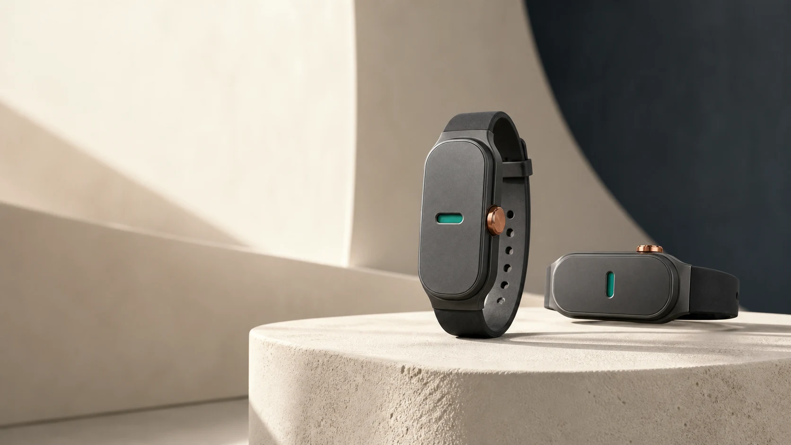

<div align="center">
  
  <h1>Voxa Cue</h1>
  <p><strong>Private coaching, right on cue.</strong></p>
  <p>A launch-ready marketing site for the phone-first haptic speech coach.</p>
</div>



## What this site communicates

Voxa Cue listens through the built-in iPhone microphone, measures speaking
delivery on-device, and sends deterministic coaching cues over Bluetooth Low
Energy to the Voxa Cue band. The live path never waits for the network. Raw audio is
not retained or uploaded.

The website tells that story through:

- A responsive editorial product page with a floating navigation island
- Original product and lifestyle imagery generated from the real band reference
- An interactive preview of the four default haptic patterns
- An accurate, clearly labeled illustrative session summary
- A concrete explanation of on-device privacy and optional post-session AI
- A validated waitlist preview that stores its entry only in local browser storage
- Privacy, terms, support, sitemap, robots, metadata, icon, and Open Graph art

## Stack

| Layer | Choice |
| --- | --- |
| Framework | Next.js 16 App Router |
| Language | Strict TypeScript |
| UI | React 19 and Tailwind CSS 4 |
| Typography | Self-hosted Manrope and Newsreader through `next/font` |
| Images | Optimized local WebP assets through `next/image` |
| Testing | Vitest plus ESLint and TypeScript |
| Deployment target | Vercel |

## Run locally

Requirements: Node.js 22 or newer and pnpm 10.32.1.

```sh
pnpm install --frozen-lockfile
pnpm dev
```

Open [http://localhost:3000](http://localhost:3000).

## Verify the release build

```sh
pnpm verify
```

That command runs lint, strict type checking, behavior tests, and a production
Next.js build. Run the compiled site with:

```sh
pnpm start
```

## Project map

```text
voxa-cue-web/
├── docs/
│   └── image-prompts.json       Exact structured generation specs
├── public/images/               Optimized product and brand assets
├── src/app/                     Pages, metadata, legal routes, and CSS
├── src/components/              Interactive and presentation components
├── src/lib/                     Waitlist validation and behavior tests
├── .env.example                 Canonical site URL configuration
└── package.json                 Run and verification commands
```

## Original imagery

All four campaign images were created with the built-in OpenAI image generation
tool using the current Voxa Cue band as a geometry and materials reference.

| Asset | Purpose |
| --- | --- |
| `public/images/voxa-hero-product.webp` | Hero product still life |
| `public/images/voxa-presenter.webp` | Presenter and phone-first use case |
| `public/images/voxa-wrist-detail.webp` | Tactile wrist detail |
| `public/images/voxa-engineering.webp` | Exploded haptic engineering detail |

The exact JSON prompt specifications, invariants, source output paths, and brand
tokens are preserved in [`docs/image-prompts.json`](docs/image-prompts.json).

## Product truth boundaries

- The built-in iPhone microphone is the only live audio source.
- Live speech processing, metric calculation, cue selection, and persistence run
  on the phone.
- CoreBluetooth sends pattern and intensity commands to the wearable.
- The band never receives voice audio, a transcript, or identity data.
- Raw audio is never retained or uploaded.
- Optional AI can process a finalized transcript only after explicit consent.
- The live coaching path does not depend on an API or internet connection.
- The app analytics shown on the site are labeled illustrative session data.

## Waitlist behavior

The current waitlist is deliberately local so the marketing experience can be
tested before a backend is chosen. It validates the email, normalizes it, and
stores a small entry in `localStorage` under `voxa-cue-waitlist-preview`. Nothing
leaves the browser.

Before a public launch, connect this form to the selected waitlist provider and
update the privacy copy to name that provider and its retention policy.

## Vercel handoff

Deployment is intentionally not performed in this repository yet.

1. Set `NEXT_PUBLIC_SITE_URL` to the final HTTPS origin in Vercel project settings.
2. Run `pnpm verify` from a clean checkout.
3. Import this repository in Vercel with the default Next.js settings.
4. Confirm `/`, `/privacy`, `/terms`, `/support`, `/robots.txt`, and `/sitemap.xml`.
5. Test the form, mobile menu, haptic preview, keyboard focus, and reduced motion.

## Brand system

| Token | Value | Role |
| --- | --- | --- |
| Warm ivory | `#F3F4F1` | Quiet canvas |
| Graphite | `#0B171B` | Hardware anchor and primary ink |
| Voice signal | `#0B756F` | Listening and primary action |
| Haptic copper | `#A85E24` | Physical cues and tactile emphasis |
| Signal surface | `#E0EFEB` | Selected and supporting states |

The visual direction uses editorial warmth, tactile materials, concentric
containers, deliberate whitespace, and motion that respects reduced-motion
preferences. It avoids generic purple AI styling, excessive copy, and all-caps
display text.
